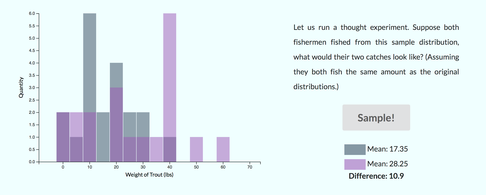

# Bootstrapping - An Explorable Explanation

*A submission for the fifth Stanford CS109 Probability for Computer Scientists Contest!*

This is meant to be an explorable explanation that people can use to learn about bootstrapping and run quick interactive experiments.

Check out the explorable [here](https://greentfrapp.github.io/bootstrapping-explorable/)!

Alternatively, here's a [video demo](https://youtu.be/dIXgW9nKFAk) and here's the [GitHub repo](https://github.com/greentfrapp/bootstrapping-explorable/) with the code.

We begin the story with two fishermen fishing for trout in two rivers. The fishermen then plot the weight distributions of their respective catches.

Then the reader is guided along the bootstrapping method - first combining the distributions, then drawing samples and finally calculating the p-value.

Finally, at the end, the reader can also enable a bonus version to edit and experiment with different input distributions!

Some interesting questions that the reader can try to answer with the explorable:

It was written from scratch with the Vue.js and D3.js libraries and hosted on GitHub pages. Hope you enjoyed it!

